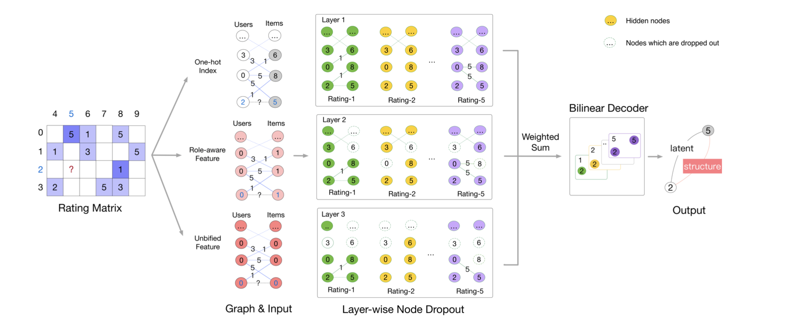

# IMC-GAE: Inductive Matrix Completion Using Graph Autoencoder for Real Recommender Systems

Paper link: 

Author's code: [https://github.com/swtheing/IMC-GAE](https://github.com/swtheing/IMC-GAE)

The implementation does not handle side-channel features and mini-epoching and thus achieves
slightly worse performance when using node features.

Credit: Wei shen ([@swtheing](https://github.com/swtheing))

## Requirements
------------

Latest tested combination: Python 3.8.1 + PyTorch 1.4.0 + DGL 0.5.2.

Install [PyTorch](https://pytorch.org/)

Install [DGL](https://github.com/dmlc/dgl)

Other required python libraries: numpy, scipy, pandas, h5py, networkx, tqdm ,bidict etc.

## Data

Supported datasets: ml-100k, ml-1m, ml-10m, flixster, douban, yahoo_music

### Usages
------

### Flixster, Douban and YahooMusic

To train on Flixster, type:

    python -u train.py --data_name=flixster --use_one_hot_fea --gcn_agg_accum=sum --device 0 --ARR 0.00000000000 --train_early_stopping_patience 200 --layers 2 --gcn_agg_units 30 --train_lr 0.01 --data_valid_ratio 0.1 --model_activation tanh --gcn_out_units 30

Change flixster to douban or yahoo\_music to do the same experiments on Douban and YahooMusic datasets, respectively. Delete --testing to evaluate on a validation set to do hyperparameter tuning.

### MovieLens-100K and MovieLens-1M

To train on MovieLens-100K, type:

    python -u train.py --data_name=ml-100k --device 0 --layers 2 --data_valid_ratio 0.05 --model_activation tanh --use_one_hot_fea --ARR 0.00004

To train on MovieLens-1M, type:

    python -u train.py --data_name=ml-1m --device 0 --layers 2 --data_valid_ratio 0.05 --model_activation tanh --use_one_hot_fea--ARR 0.000004
